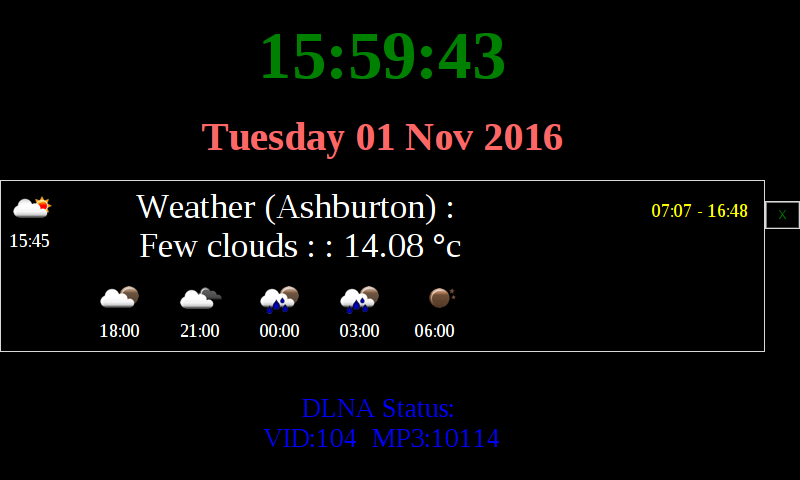

# rpi_dashboard
**Raspberry PI Dashboard**

A Dashboard for Raspberry PI Module 3 with the Raspberry 7" Touch Screen



## Features
* Time
* Date
* Reads Number of local Media Files on MiniDLNA (Music/Video)
* Gets local Weather and forecast from OpenWeather
* Checks to see if Owner is home (Pings mobile phone)
* Gets Owner's Calendar Information from Office365
* Changes Screen colour and display brightness dependant on Time of Daytime

## Data Storage
* Saves data to JSON files so does not flood online services, called `data_*.txt`
* Saves images to `icon_*.png`
* Saves a backup of current data/images which are used incase of data update failure
* Config file eClock.cfg, this is created using ```setup.py```

## System Setup
* Register with [OpenWeatherMap](http://www.openweathermap.org/)
* Install Python requirements
```
sudo pip install requests
sudo pip install pycrypto
```
* Install `O365` Python Library, using custom version from [Github (topcats/python-o365)](https://github.com/topcats/python-o365)
* run `setup.py` to create config file
* read [Backlight Setup manual](BacklightControlNotes.md)
* read [Auto run manual](AutorunNotes.md)
