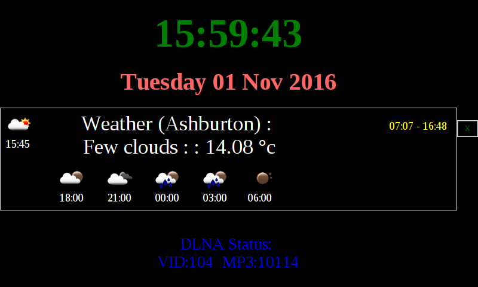

# rpi_dashboard - **Raspberry PI Dashboard**

A Dashboard for Raspberry PI Module 3 with the Raspberry 7" Touch Screen

***Upgraded to Python 3***



## Features

* Time
* Date
* Reads Number of local Media Files on MiniDLNA or Serviio (Music/Video)
* Gets local Weather and forecast from OpenWeather
* Checks to see if Owner is home (Pings mobile phone)
* Gets Owner's Calendar Information from Office365
* Changes Screen colour and display brightness dependant on Time of Daytime
* Interacts with Local Z-Wave Setup to have a small selection of actions

## Data Storage

* Saves data to JSON files so does not flood online services, called `data_*.txt`
* Saves images to `icon_*.png`
* Saves a backup of current data/images which are used incase of data update failure
* Config file eClock.cfg, this is created using ```setup.py```
* Config Password information encrypted and locked to local machine

## System Setup

* Register with [OpenWeatherMap](http://www.openweathermap.org/)
* Install system requirements

```bash
sudo apt-get install python-pygame python-pil python-imaging-tk
```

* Install Python requirements

```bash
sudo pip install requests
sudo pip install pycryptodome
sudo pip install base64
sudo python3 -m pip install ConfigParser
sudo python3 -m pip install PIL
sudo python3 -m pip install pi_heif
```

* Install `O365` Python Library, using custom version from [Github (topcats/python-o365)](https://github.com/topcats/python-o365)
* Install `zWaveAPI` Python Library, using custom version from [Github (topcats/raspberry-zwave-python)](https://github.com/topcats/raspberry-zwave-python)
* Run `setup.py` to create config file
* Read [Backlight Setup manual](BacklightControlNotes.md)
* Read [Auto run manual](AutorunNotes.md)
